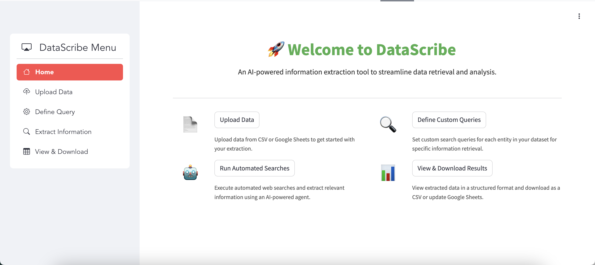
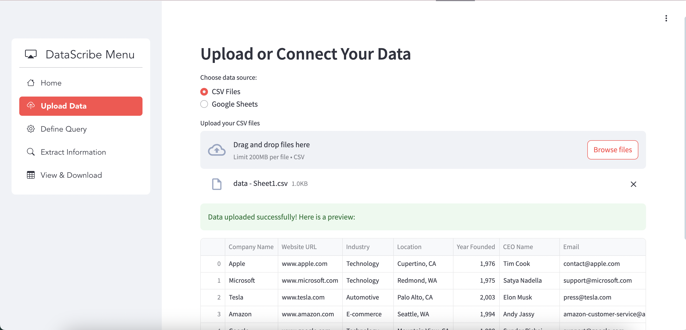
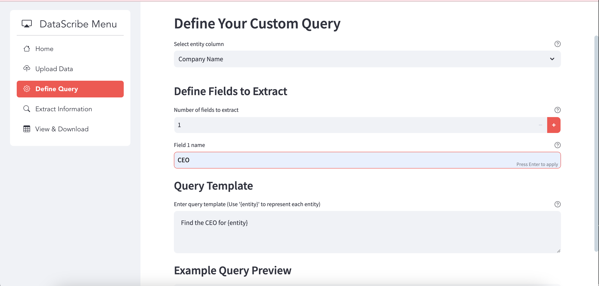
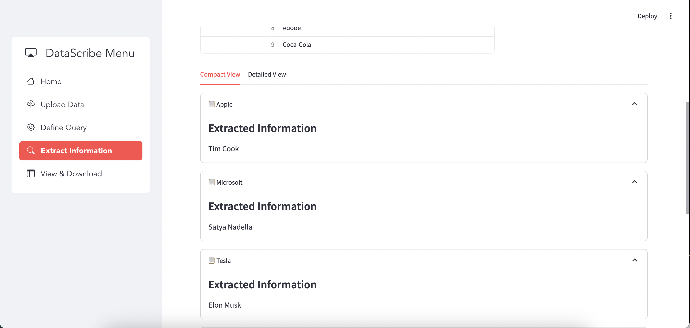
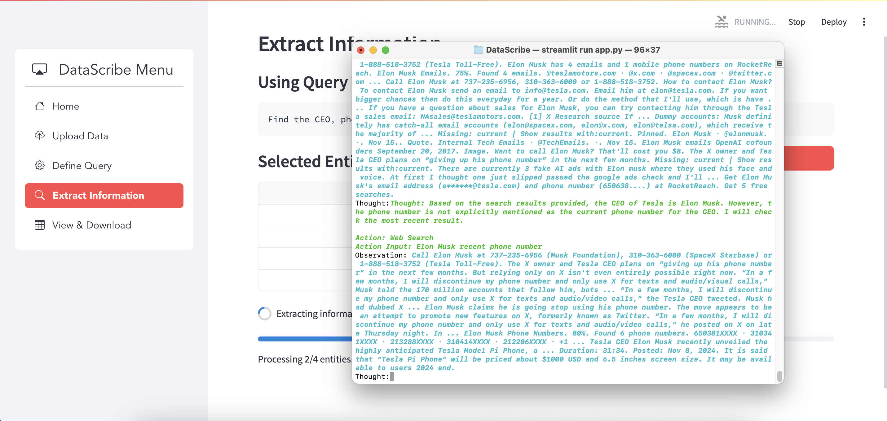
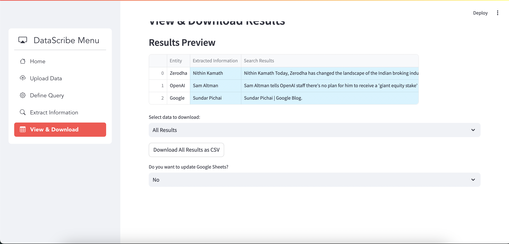
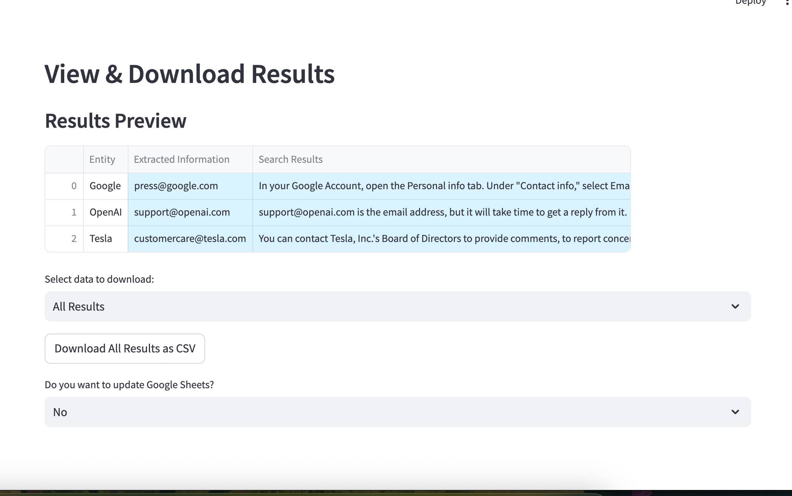
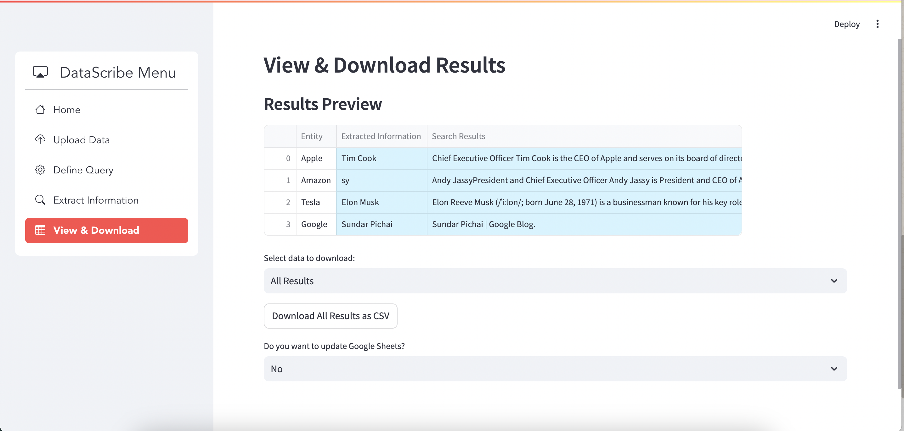

# **DataScribe: AI-Powered Information Extraction**  

DataScribe is an intelligent AI agent designed to streamline data retrieval, extraction, and structuring. By harnessing the power of Large Language Models (LLMs) and automated web search capabilities, it enables users to extract actionable insights from datasets with minimal effort. Designed for efficiency, scalability, and user-friendliness, DataScribe is ideal for professionals handling large datasets or requiring quick access to structured information.  

---

## 🚀 **Key Features**  

### Core Functionalities  
1. **File Upload & Integration**  
   - Upload datasets directly from CSV files.  
   - **Google Sheets Integration**: Seamlessly connect and interact with Google Sheets.  

2. **Custom Query Definition**  
   - Define intuitive query templates for extracting data.  
   - **Advanced Query Templates**: Extract multiple fields simultaneously, e.g., "Find the email and address for {company}."  

3. **Automated Information Retrieval**  
   - **LLM-Powered Extraction**: Uses ChatGroq for LLM processing and Serper API for web searches.  
   - **Retry Mechanism**: Handles failed queries with robust retries for accurate results.  

4. **Interactive Results Dashboard**  
   - View extracted data in a clean, dynamic, and filterable table view.  

5. **Export & Update Options**  
   - Download results as CSV or directly update Google Sheets.  

---

## 🛠️ **Technology Stack**

| **Component**       | **Technologies**                           |
|----------------------|-------------------------------------------|
| **Dashboard/UI**     | Streamlit                                |
| **Data Handling**    | pandas, Google Sheets API (Auth0, gspread)|
| **Search API**       | Serper API, ScraperAPI                   |
| **LLM API**          | Groq API                                 |
| **Backend**          | Python                                   |
| **Agents**           | LangChain                                |

---

## 📂 **Repository Structure**

```
DataScribe/
├── app.py                     # Main application entry point
├── funcs/                     # Core functionalities
│   ├── googlesheet.py         # Google Sheets integration
│   ├── llm.py                 # LLM-based extraction and search
├── views/                     # UI components and layout
│   ├── home.py                # Home page and navigation
│   ├── upload_data.py         # File upload and data preprocessing
│   ├── define_query.py        # Query definition logic
│   ├── extract_information.py # Information extraction workflows
│   ├── view_and_download.py   # Result viewing and export functionalities
├── requirements.txt           # Dependency list
├── .env.sample                # Environment variable template
├── credentialsample.json      # Google API credentials template
├── README.md                  # Documentation
├── LICENSE                    # License information
```

---

## 📖 **Setup Instructions**

### Prerequisites  
- Python 3.9 or higher.  
- Google API credentials for Sheets integration.  

### Installation Steps  

1. **Clone the Repository**  
   ```bash
   git clone https://github.com/sam22ridhi/DataScribe.git
   cd DataScribe
   ```  

2. **Install Dependencies**  
   ```bash
   pip install -r requirements.txt
   ```  

3. **Set Up Environment Variables**  
   - Copy the `.env.sample` file to `.env`:  
     ```bash
     cp .env.sample .env
     ```  
   - Add the required API keys to the `.env` file:  
     ```plaintext
     GOOGLE_API_KEY=<your_google_api_key>
     SERPER_API_KEY=<your_serper_api_key>
     ```  

4. **Prepare Google API Credentials**  
   - Replace the content in `credentialsample.json` with your Google API credentials and save it as `credentials.json`.

5. **Run the Application**  
   ```bash
   streamlit run app.py
   ```  

6. **Access the Application**  
   Open [http://localhost:8501](http://localhost:8501) in your browser.  

---

## 🛠️ **Usage Guide**  

1. **Upload Data**  
   Navigate to the **Upload Data** tab to import a CSV file or connect to Google Sheets.  

2. **Define Query**  
   Use the **Define Query** tab to specify search templates. Select the column containing the entities and define fields to extract.  

3. **Extract Information**  
   Execute automated searches in the **Extract Information** tab to fetch structured data.  

4. **View & Download**  
   Review the results in the **View & Download** tab, then export as CSV or update Google Sheets directly.  

---

## 🌟 **Screenshots**  

#### **Home Page**  


#### **File Upload**  


#### **Define Query**  


#### **Extracted Data**  


#### **Running the Application**  




#### **View & Download Results**  
 


---

## 📝 **Loom Video Walkthrough**  

Watch the [2-minute walkthrough](https://www.loom.com/share/2da6b8a8929b46698b4c61aa57d3b461?sid=ef63cba4-37db-468d-86f1-e52ee08d7e0c) showcasing:  
1. Overview of DataScribe's purpose and features.  
2. Key workflows, including upload, extraction, and export.  
3. Code features

## 📝 **Hugging Face Tryout**  

Try out on [huggin face link](https://huggingface.co/spaces/samiee2213/DataScribe) 


## 🙌 **Acknowledgements**  

Special thanks to **Breakout AI** and **Kapil Mittal** for their opportunity to demonstrate my skills through this project/assessment.  

---

## 📜 **License**  

This project is licensed under the [Apache License 2.0](LICENSE).  

---

## 🤝 **Contributing**

We welcome contributions!  
1. Fork the repository.  
2. Create a feature branch.  
3. Submit a pull request with a detailed description of changes.

---

## 📬 **Contact**  

For feedback or support:  
- [Open an Issue](https://github.com/sam22ridhi/DataScribe/issues)  
- Email: **samridhiraj04@gmail.com**  

---  

